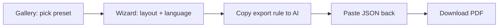

# CVPro

[](LICENSE)
[](https://react.dev/)
[](https://www.typescriptlang.org/)
[](https://vitejs.dev/)

**CVPro** is an open-source web app to build professional CVs/résumés as PDF — without wiring an AI API. Pick a role preset, copy an export rule for ChatGPT / Claude / Gemini, paste back structured JSON, preview, and download a print-ready PDF.

**Tiếng Việt:** Ứng dụng tạo CV chuyên nghiệp: chọn mẫu theo nghề → export rule cho AI → import JSON → tải PDF. Hỗ trợ tiếng Việt đầy đủ (Noto Sans), không cần backend.

---

## Why CVPro?

| Problem | CVPro approach |
|--------|----------------|
| Word/Google Docs layouts break easily | Fixed PDF layouts via `@react-pdf/renderer` |
| AI writes great content but messy format | **Zod-validated JSON** + deterministic templates |
| ATS vs “beautiful” CV trade-off | **3 layouts**: professional, editorial 2-column, minimal ATS |
| Privacy / cost of in-app AI | **No AI API** — you use your own ChatGPT/Claude/Gemini account |

---

## Features

- **19 profile presets** — dev, PM, BA, QA, marketing, sales, accounting, career switcher, English tech, etc.
- **4-step wizard** — layout → export rule → import JSON → preview & download PDF
- **3 PDF personalities**
  - **Modern (1 column)** — bold header, contact lines, section rules
  - **Compact (2 columns)** — sidebar profile + **avatar**, dark section bars, **experience timeline**
  - **Minimal ATS** — flat, aligned dates, ATS-friendly
- **Vietnamese & English** — section labels and export rules follow `meta.language`
- **Vietnamese typography** — Noto Sans embedded for PDF and UI
- **Draft autosave** — wizard state in `localStorage`
- **Zero backend** — static SPA, deploy anywhere (Vercel, Netlify, GitHub Pages)

---

## Quick start

**Requirements:** Node.js ≥ 20.12 (recommended ≥ 20.19), npm

```bash
git clone https://github.com/jsc2017605097/cvpro.git
cd cvpro
npm install
npm run dev
```

Open [http://localhost:5173](http://localhost:5173)

### Production build

```bash
npm run lint && npm test && npm run build
npm run preview
```

---

## How it works



1. **Gallery** — Choose a CV profile preset (sections & skill hints baked in).
2. **Layout** — `modern-single` | `compact-two` | `minimal-ats`, language `vi` | `en`.
3. **Export rule** — Copy/download `.txt` prompt; AI returns JSON matching `CVData` schema.
4. **Import** — App parses markdown fences or raw `{...}` and validates with Zod.
5. **PDF** — `@react-pdf/renderer` renders the chosen layout.

**Compact layout tip:** include a public `personal.avatarUrl` (https image) in JSON for a circular photo in the sidebar.

---

## Tech stack

| Layer | Choice |
|-------|--------|
| Build | Vite 6 |
| UI | React 19, TypeScript 5.8, Tailwind CSS 4 |
| Routing | react-router-dom 7 |
| Validation | Zod 3 (`CVData` single source of truth) |
| PDF | `@react-pdf/renderer` 4 + Noto Sans TTF |
| Test | Vitest 3, Testing Library |

---

## Project structure

```
src/
  schemas/          # Zod CVData
  data/presets/     # 19 preset JSON files
  data/layouts.ts   # Layout metadata + thumbnails
  lib/              # extract-json, import-cv, export-rule, draft-storage
  features/
    catalog/        # Preset gallery
    wizard/         # 4-step flow
    pdf/            # tokens, labels, primitives, layouts
  components/ui/design/
public/fonts/       # Noto Sans for PDF
public/thumbnails/  # Layout preview SVGs
```

---

## PDF layouts

| ID | Style | Best for |
|----|--------|----------|
| `modern-single` | Single column, header + rules, professional | General / corporate |
| `compact-two` | 35% sidebar (photo, skills), timeline body, section bars | Tech / modern editorial |
| `minimal-ats` | Flat, dates aligned, no decoration | ATS portals, job boards |

Labels: **Kinh nghiệm** / **Experience**, etc. from `meta.language`.

---

## Scripts

| Command | Description |
|---------|-------------|
| `npm run dev` | Development server |
| `npm run build` | Typecheck + production build |
| `npm run preview` | Preview production build |
| `npm run lint` | ESLint 9 |
| `npm test` | Vitest unit tests |

---

## Deploy

**Vercel (recommended):** Framework preset **Vite**, output directory `dist`.

```bash
npm run build
npx vercel --prod
```

Also works on Netlify, Cloudflare Pages, or any static host.

---

## Contributing

Issues and PRs are welcome. Please run `npm run lint`, `npm test`, and `npm run build` before submitting.

1. Fork the repo
2. Create a branch (`feat/my-feature`)
3. Commit with [Conventional Commits](https://www.conventionalcommits.org/)
4. Open a PR

---

## Roadmap

- [ ] DOCX export
- [ ] In-browser PDF preview
- [ ] Wizard field for `avatarUrl`
- [ ] Per-preset required-section validation in UI

---

## License

[MIT](LICENSE) — see [LICENSE](LICENSE) for details.

---

## Author

Built with ☕ for job seekers who want **AI-written content** and **designer-grade PDF layout** without subscription lock-in.

If this project helps you land interviews, consider **starring ⭐ the repo** so others can discover it.
